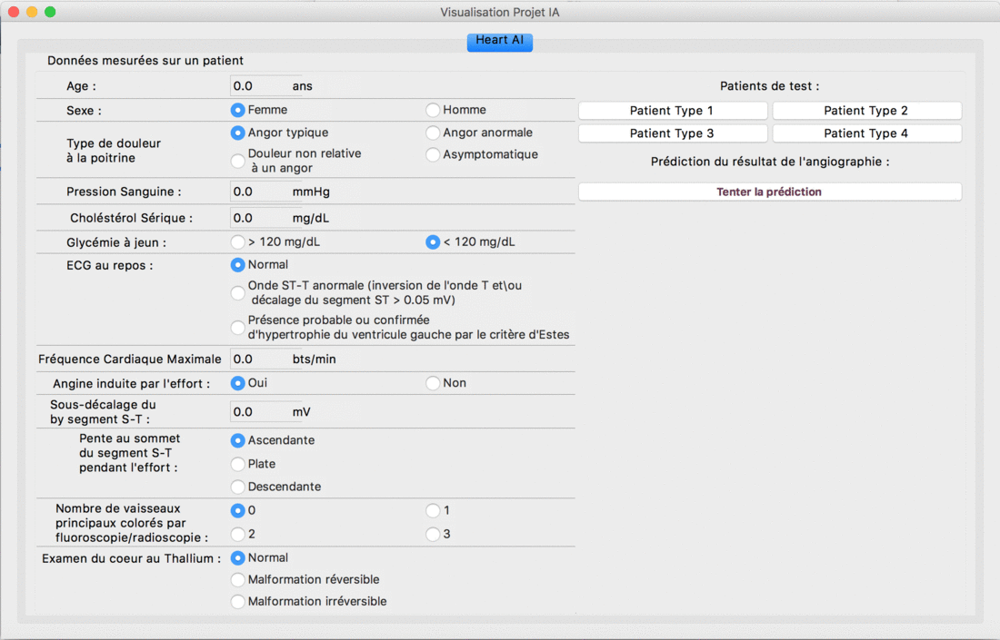

French version can be found in [README-FR.md](README-FR.md)

# Heart-Disease-Prediction
Heart Disease Angiographic Prediction.
This is an implementation of 3 machine learning classifier for demonstration purpose to medical staff in a French Hospital. 
Documentation (in French) about this project can be found in [documentation ](/documentation).
ML implementation structure is directly inspired from the project [Heart_Disease_Prediction](https://github.com/bveber/Heart_Disease_Prediction) by [Brandon Veber](https://github.com/bveber).  
The GUI has been re-written in Python using tkinter GUI toolkit.  
The GUI is in French. Values can be initialized with 4 examples samples. This has been added for demonstration purpose.

 

Nota Bene : The result of the prediction is given in a box that asks the user (doctor) to validate or not the prediction. This has been made for educationnal purpose, to show the doctors how they could improve the existing model by adding their data. Their is no implementation behind. (even if it would not be difficult). There is no plan to add one.

Nota Bene 2 : code is duplicated for the 3 classification algorithms and could be refactored way better.

To run, run GUI.py with python3.

Author: Cyril de Catheu  
Created: 31-03-2018  
Last Modified: 31-03-2018  
Tested on OS X Sierra, Windows 8  

## Requires:
Python >= 3.4.1: 
	Python package dependencies:  
		sklearn >= 0.16.1  
		numpy   >= 1.9.0  
		pandas  >= 0.15.0   

## Prediction Technical Specifications:
### Data:
	The data is from the UCI Machine Learning Repository Heart Disease Data Set: 
	https://archive.ics.uci.edu/ml/datasets/Heart-Disease
	procesessed.cleveland.data contains 303 samples with 13 input features, and target value.
	procesessed.all.data contains 920 samples. Data is more sparse in this dataset.

 
### Input Features :
	Age - real number
	Sex - categorical
	Chest pain type - categorical
	Resting blood pressure - real number
	Serum cholesterol - real number
	Fasting blood sugar - real number (internally converted to categorical)
	Resting ECG results - categorical
	Maximum achievable heart rate - real number
	Exercised induced angina - categorical
	ST depression induced by exercise relative to rest - real number
	Slope of the peak exercise ST segment - categorical
	Number of major vessels colored by floroscopy - real number
	Thallium heart scan - categorical

### Feature encoding:
	All categorical features are converted to binary using a 
	one-hot encoder

### Feature normalization:
	All real numbers are scaled using a standard scaler (subtract mean
	and divide by standard deviation)

### Machine Learning Algorithm:
#### SVM Classifier
	A radial basis kernel SVM classifier is used for making predictions.
	The output is a probability representing the likelihood of the 
	presence of heart disease.

	Expected Accuray: processed.cleveland.data
		The data was tested using a 10-fold cross validation technique.
		The results are:
		Avg Accuracy   Avg Recall     Avg Precision  Avg ROC_AUC
		0.842          0.792          0.863          0.932
	Expected Accuray: processed.all.data
		The data was randomly shuffled and tested using a 10-fold cross validation technique.
		The average results for 5 cross validations are:
		Avg Accuracy   Avg Recall     Avg Precision  Avg ROC_AUC
		0.827          0.872          0.825          0.891
		
#### Naive Bayes Classifier
	A Naive Bayes classifier for multivariate Bernoulli is used for making predictions.
	Please keep in mind that using this classifier for this dataset is clearly not a good choice.
	Made only for demonstration purpose : accuracy for the small dataset is quite good. 
	The output is a probability representing the likelihood of the 
	presence of heart disease.

	Expected Accuray: processed.cleveland.data
		The data was tested using a 10-fold cross validation technique.
		The results are:
		Avg Accuracy   Avg Recall     Avg Precision  Avg ROC_AUC
		0.832          0.821          0.812          0.905
	Expected Accuray: processed.all.data
		The data was randomly shuffled and tested using a 10-fold cross validation technique.
		The average results for 5 cross validations are:
		Avg Accuracy   Avg Recall     Avg Precision  Avg ROC_AUC
		0.798          0.805          0.826          0.875
		
#### Gradient Boosting Classifier
	A Gradient Boosting classifier is used for making predictions.
	This algorithm is the only one that got better results when scaling to the full dataset.
	The output is a probability representing the likelihood of the 
	presence of heart disease.

	Expected Accuray: processed.cleveland.data
		The data was tested using a 10-fold cross validation technique.
		The results are:
		Avg Accuracy   Avg Recall     Avg Precision  Avg ROC_AUC
		0.795          0.758          0.800          0.914
	Expected Accuray: processed.all.data
		The data was randomly shuffled and tested using a 10-fold cross validation technique.
		The average results for 5 cross validations are:
		Avg Accuracy   Avg Recall     Avg Precision  Avg ROC_AUC
		0.813          0.854          0.817          0.900

## Next Steps :	
Try the R* algorithm.  
Work on the optimization of the GradientBoosting.
